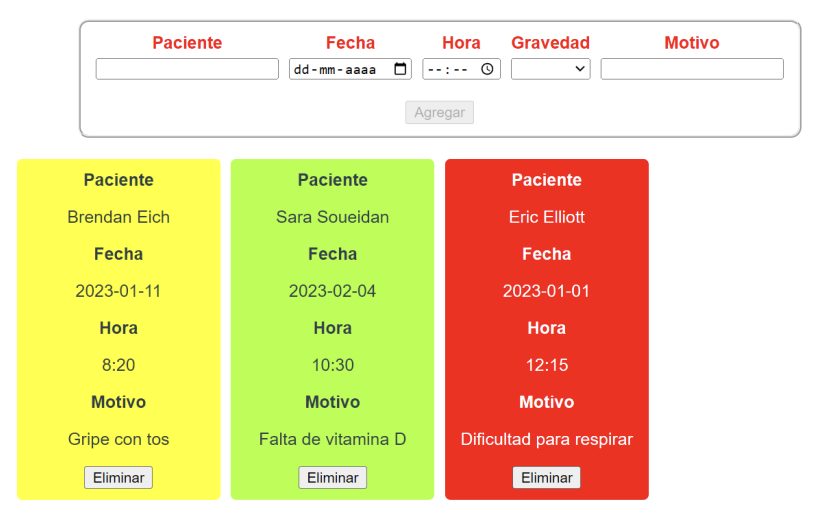

# Desafío: Manejode eventos y reutilización de componentes.

## Consigna

Crear un pequeño administrador de citas médicas por medio de Vue.js, en donde se debe tener un formulario con los siguientes campos: 
- Paciente
- Fecha
- Hora
- Gravedad
- Motivo

Los labels del formulario deberán estar de color rojo mientras que su input correspondiente esté vacío, de lo contrario deberán retornar su color natural (negro).  

El botón Agregar deberá mantenerse deshabilitado hasta que todos los campos del
formulario tengan valor.  
Debajo del formulario deberá mostrarse un mensaje indicando que aún no hay consultas
registradas mientras no se registre ninguna cita.  

Una vez agregada una cita se deben limpiar los campos del formulario y renderizar la
información de las citas en un formato de tarjeta (card).  

Cada cita debe ser una renderización dinámica de un componente hijo que reciba por medio
de props la información de la cita.  
Cada gravedad definida en las citas debe definir el color de fondo de la tarjeta relacionada.  

Los diferentes niveles y colores pueden ser:
- Baja: Verde
- Media: Amarillo
- Alta: Rojo  

Finalmente, se debe programar la interacción para el botón Eliminar, la cual debe ser un
evento emitido al componente padre para su eliminación del arreglo donde se están
registrando las consultas.

### Requerimientos
1. Utilizar los eventos y las modificadores para agregar interacciones en la aplicación.  
2. Reutilizar componentes para el ahorro de tiempo en el desarrollo de una aplicación.  
3. Hacer uso de las props para el paso de datos a componentes hijos.  
4. Cambiar los estilos de elementos a partir de eventos emitidos por el usuario.  
5. Comunicar componentes hijos con su padre a través de la emisión de eventos.  